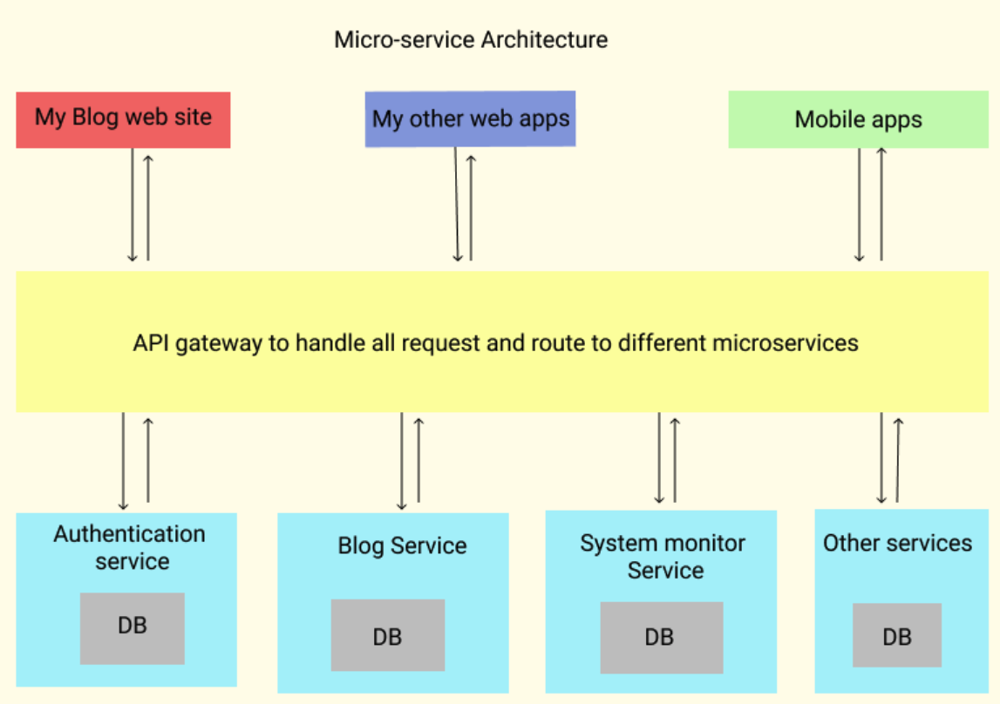

# Microservices Architecture

This is my first time using microservice architecture to build a backend system to power up all my apps and blog website, and it will continue growing to support all my future development too.

---

## Currently supported front ends

[https://pengchen.work](https://pengchen.work)

My main blogging and portfolio website. Partially done. Still under development.

[Click here to see Github Repo](https://github.com/PengChen11/pengchen.work)

---

## Current back end microservices list

**Authentication service** : Handles user authentication and microservices internal authentications.

for user security concern, it is made private.

[**Blog service :**](https://github.com/PengChen11/Microservices-Blog) Handles CRUD operations for blogging. Includes my projects, and articles that I wrote. (click to redirect to repo)

[**System monitoring service :**](https://github.com/PengChen11/Microservices-Sys_Monitor) Handles system monitoring need. Can record system errors, warnings and events for all microservices. (click to redirect to repo)

[**API gateway :**](./docs/gateway_readme.md) Handles all external requests and apply authorization control. Click it to see full tech details.

---

## Table of Contents

---

- [Microservices Architecture](#microservices-architecture)
  - [Currently supported front ends](#currently-supported-front-ends)
  - [Current back end microservices list](#current-back-end-microservices-list)
  - [Table of Contents](#table-of-contents)
  - [**Overview**](#overview)
    - [**What is a Microservice?**](#what-is-a-microservice)
    - [**Why I choose to use Microservices architecture?**](#why-i-choose-to-use-microservices-architecture)
  - [**API Gateway**](#api-gateway)
    - [**What is API Gateway and why to use it**](#what-is-api-gateway-and-why-to-use-it)
    - [**What problem will the API Gateway solve**](#what-problem-will-the-api-gateway-solve)
  - [TBD](#tbd)
  - [Authors](#authors)
  - [License](#license)
  - [Acknowledgements / Resources](#acknowledgements--resources)

---

## **Overview**

### **What is a Microservice?**

Based on info from <https://microservices.io> :
>Microservices - also known as the microservice architecture - is an architectural style that structures an application as a collection of services that are :
>
> - Highly maintainable and testable
> - Loosely coupled
> - Independently deployable
> - Organized around business capabilities
> - Owned by a small team

### **Why I choose to use Microservices architecture?**

Why? Here's a great Article to discuss the advantages and disadvantages for the Microservices architecture :  
[7 reasons to switch to microservices — and 5 reasons you might not succeed](https://www.cio.com/article/3201193/7-reasons-to-switch-to-microservices-and-5-reasons-you-might-not-succeed.html)

I am new to development world, and have been spend a lot of time developing monolith applications. But they are all unique and separated from each other. None of the components could be shared with between different applications.

For example, if I have two apps that both require user login, I'll have to build two database to store user info for them, and they will both have the logic to handle the user authentication and authorization and it's a pain.

Then one day I discovered something really interesting from Microsoft : **No matter I want to login to my Xbox account, or Outlook email, or Microsoft.com, Or MS365, it will all re-route me to login.live.com**.
It looks like they have a centralized auth center to handle all the login request for their different products.

**I want it too. Badly.**

 After that I've spend ton of hours try to understand how Microservice architecture works.

Here's what I am trying to achieve with this implementation:

1. Able to share public services between apps, like:
   1. user authentication
   2. user account management
   3. system logging
   4. centralized Admin portal to manage all my applications.
   5. Anything else you can think about, as a re-useable service.
2. Able to deploy each small scale services to a cloud provider with small to no fees.
   1. I am not being hired yet and don't have money to pay for web hosting, but I want to develop interesting apps.
   2. I can break done each part of the app to small scales and deploy to Heroku, or AWS, Azure, for free.
   3. AWS has lambda serverless options, and they both offer free tier VMs, which made it great to fit my need.
3. Able to let me focus on one small piece of the service to make improvement, without think about it may break other features.
   1. To me, this is the beauty of the microservices. As a company, you can delicate different teams to work on individual services without worrying to create more bugs to other teams. All you need to do is to get it done with in the service, and expose the API correctly for other service to consume.
   2. I can create the core services to make the app work, then take my time to improvement the user experiences and add more feature.
   3. Service can be easily scale up, if one day I have many users and that is needed. VS to monolith, have to scale up as a whole.
4. draw backs:
   1. Response time. Traditional monolithic applications has all the moving parts live in memory, it is much faster to ask Module A to provide info or do calculation for Module B with in this application.  However, Microservices physically separate Module A and Module B on different services, deployed on different servers, They have to communicate with RESTful API and that network communication time will affect the user experience.
   2. Complexity of the system design. It is harder to design the system, even harder to make it work together like a monolith, and much harder when trouble shooting bugs. Thus Error logging and tracing is really important when designing the system.
   3. I am still think about what else to put here.

---

## **API Gateway**

### **What is API Gateway and why to use it**

Here's a great article explains what is an API gateway and why it is needed.  
[Pattern: API Gateway / Backends for Frontends](https://microservices.io/patterns/apigateway.html)

Why to use it? Do I have to use an API gateway? Well, no, you don't have to. Like you don't have to wear seat belt when driving cars, but by doing so will bring a lot of benefits to you.

### **What problem will the API Gateway solve**

Like wearing the car seat belt example, by using API gateway, it will help you on:

1. Securing the real end-points of your services.
2. easy routes management for different services.
   1. think about this, if you do not have a gateway for your micro services, you'll have to make you front end web app or mobile app consume each service individually. That will be a pain to maintenance the track of everything.
   2. What if, one request need to involve several services? without a gateway, the logic will have to be handled in the front-end part, make the developer team can NOT focus on what they should focus on.
   3. What about user authentication and authorization? How you will handle protected routes if there's a stand alone Auth service there, and another service do require the user to be authenticated and authorized to access the info?
   4. Who will monitor all my web traffics? Help me to debug when error occurs, and log what ever needed to be logged? 
   5. A service API gateway can solve all the above questions. It will hide all your real services end-points to public, and you can easily apply authentication and authorization to protect the routes, and since this API gateway handles all the traffic for my app, I can easily make it log everything.
3. Load Balancing.
   1. I was a system / network engineer before transitioning to  developer and I know how important load balancing is to large scale of enterprise applications.
   2. AWS and Azure have a very mature way to handle load balancing, but they all come with cost for real money. My app is not on that scale and I don't have the money to pay for it yet. So I implemented a software way to load balance the requests to the services, if I have more than one service to handle the same functionality.  

## TBD

More is coming.

## Authors

- Software Developer: Peng Chen
  - [Official Github](https://github.com/PengChen11)

## License

This project is under the MIT License.

## Acknowledgements / Resources

- [Things about microservices](https://microservices.io)

- [7 reasons to switch to microservices — and 5 reasons you might not succeed](https://www.cio.com/article/3201193/7-reasons-to-switch-to-microservices-and-5-reasons-you-might-not-succeed.html)
